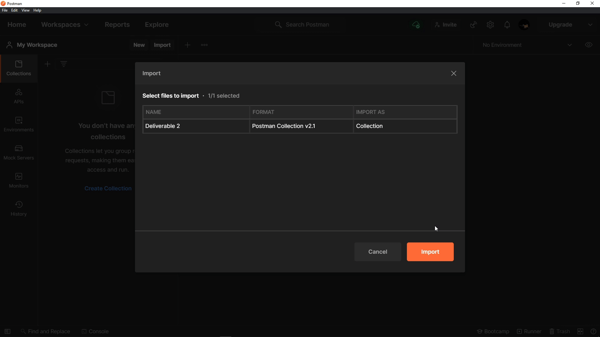

**The University of Melbourne**
# INFO30005 – Web Information Technologies

# Group Project Repository

<!-- Welcome!

We have added to this repository a `README.md`, `.gitignore`, and `.gitattributes`.

* **README.md**: is the document you are currently reading. It should be replaced with information about your project, and instructions on how to use your code in someone else's local computer.

* **.gitignore**: lets you filter out files that should not be added to git. For example, Windows 10 and Mac OS create hidden system files (e.g., .DS_Store) that are local to your computer and should not be part of the repository. This files should be filtered by the `.gitignore` file. This initial `.gitignore` has  been created to filter local files when using MacOS and Node. Depending on your project make sure you update the `.gitignore` file.  More information about this can be found in this [link](https://www.atlassian.com/git/tutorials/saving-changes/gitignore).

* **.gitattributes**: configures the line ending of files, to ensure consistency across development environments. More information can be found in this [link](https://git-scm.com/docs/gitattributes).

Remember that _"this document"_ can use `different formats` to **highlight** important information. This is just an example of different formating tools available for you. For help with the format you can find a guide [here](https://docs.github.com/en/github/writing-on-github). -->

## Table of contents
- [INFO30005 – Web Information Technologies](#info30005--web-information-technologies)
- [Group Project Repository](#group-project-repository)
  - [Table of contents](#table-of-contents)
  - [Team Members](#team-members)
  - [General info](#general-info)
  - [Technologies](#technologies)
  - [Postman Requests](#postman-requests)
    - [Customer App](#customer-app)
    - [Vendor App](#vendor-app)
    - [How to use Postman](#how-to-use-postman)
  - [Project Website](#project-website)
  - [Database Access](#database-access)
  <!-- - [Code Implementation](#code-implementation)
  - [Adding Images](#adding-images) -->

## Team Members

| Name | Task | State |
| :---         |     :---:      |          ---: |
| Jack Lenard  | Back End     |  In Progress|
| Jun Li Chen (Cedric)    | Back End      |  In Progress |
| Paris Eckert    | Front End      |  In Progress |
| Zac Beaumont    | Front End      |  In Progress |
| Jeongwoo Seo    | Front End      |  In Progress |

## General info
This is a project ...
Lorem ipsum dolor sit amet, consectetur adipiscing elit, sed do eiusmod tempor incididunt ut labore et dolore magna aliqua. Ut enim ad minim veniam, quis nostrud exercitation ullamco laboris nisi ut aliquip ex ea commodo consequat. Duis aute irure dolor in reprehenderit in voluptate velit esse cillum dolore eu fugiat nulla pariatur. Excepteur sint occaecat cupidatat non proident, sunt in culpa qui officia deserunt mollit anim id est laborum

## Technologies
Project is created with:
* NodeJs 14.16.X
* Ipsum version: 2.33
* Ament library version: 999
* **mongoose**
* **express**
* **express-handlebars**
* **express-session**
* **handlebars**
* **dotenv**

<!-- ## Code Implementation

You can include a code snippet here.

```HTML
<!--
Example code from: https://www.w3schools.com/jsref/met_win_alert.asp
__>

<!DOCTYPE html>
<html>
<body>

<p>Click the button to display an alert box.</p>

<button onclick="myFunction()">Try it</button>

<script>
function myFunction() {
  alert("Hello! I am an alert box!");
}
</script>

</body>
</html>
```

## Adding Images

You can use images/gif hosted online:

<p align="center">
  
</p>

Or you can add your own images from a folder in your repo with the following code. The example has a folder `Gifs` with an image file `Q1-1.gif`:
```HTML
<p align="center">
  
</p>
```

To create a gif from a video you can follow this [link](https://ezgif.com/video-to-gif/ezgif-6-55f4b3b086d4.mov).

You can use emojis :+1: but do not over use it, we are looking for professional work. If you would not add them in your job, do not use them here! :shipit: -->

**Now Get ready to complete all the tasks:**

- [x] Read the Project handouts carefully
- [x] User Interface (UI)mockup
- [ ] App server mockup
- [ ] Front-end + back-end (one feature)
- [ ] Complete system + source code
- [ ] Report on your work(+ test1 feature)


##  Postman Requests
### Customer App
- **GET** customer homescreen
  - returns the customer homescreen

- **GET** view menu of snacks
  - returns an array of JSON food objects(?) fetched from the database

- **GET** view details of an individual snack
  - returns a JSON file of an individual snack using the `:name` supplied from 
  `[server-name]/customer/menu/:name`

- **POST** start an order by requesting a snack
  - sends a JSON file of the `vendorID`, `loginID` & `count` of an individual snack using the `:name` supplied from `[server-name]/customer/menu/:name` and creates a new order with a new `OrderID`
  - returns the `name` of snack ordered

### Vendor App
- **GET** vendor homescreen
  - returns the customer homescreen

- **GET** view information of an individual vendor van
  - returns a JSON file of an individual vendor van using the `:id` supplied from `[server-name]/vendor/:id`

- **POST** set individual vendor van status & location
  - sends a JSON file of `address`, `latitude` & `longitude` of an individual vendor van using the `:id` supplied from `[server-name]/vendor/:id` to update said vendor van's status & location
  - returns a `Setting van status` message

- **GET** show list of outstanding orders for a vendor van
  - returns an array of JSON order objects(?) of a vendor van fetched from the database

- **POST** mark an individual order as 'fulfilled'
  - sets an order to 'fulfilled' using the `orderID` supplied from `[server-name]/vendor/:id/orders/:OrderID`

### How to use Postman
1. Import `Deliverable 2.postman_collection.json` into Postman.
2. Click on each requests to access them.
<p align="center">
  
</p>

## Project Website
URL: `http://project-t16-ctrl-alt-elite.herokuapp.com/`

## Database Access
Connection String (using MongoDB Compass): `mongodb+srv://<username>:<password>@ctrl-alt-elite.ys2d9.mongodb.net/test`
<br> Username : defaultuser (replace `<username>`)<br> Password : defaultuser (replace `<password>`)

